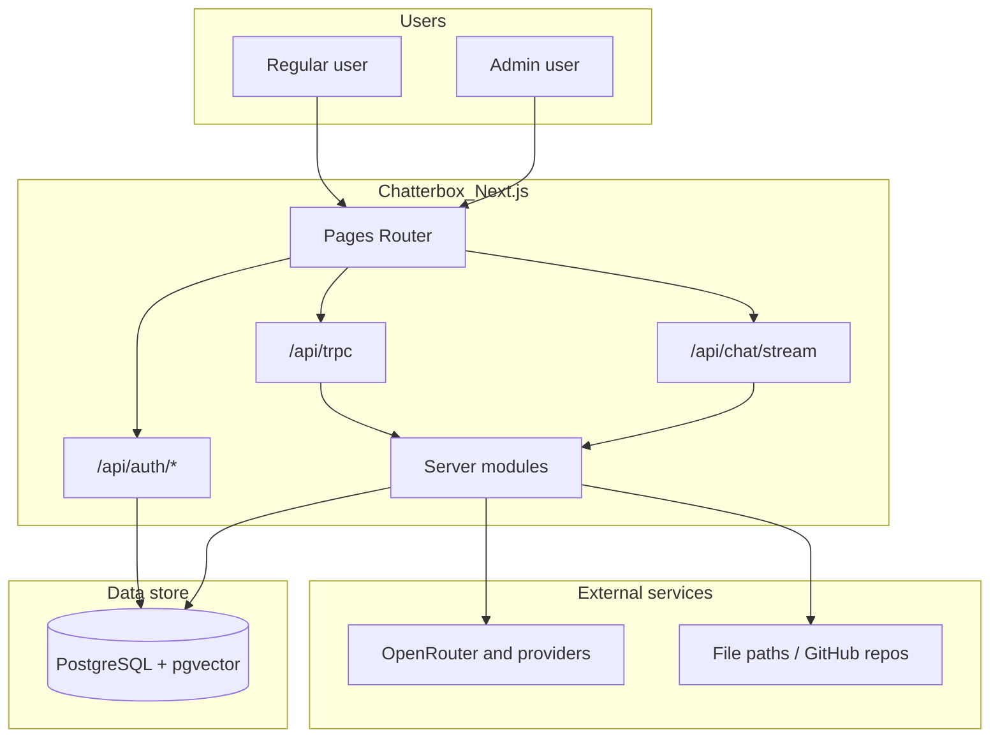
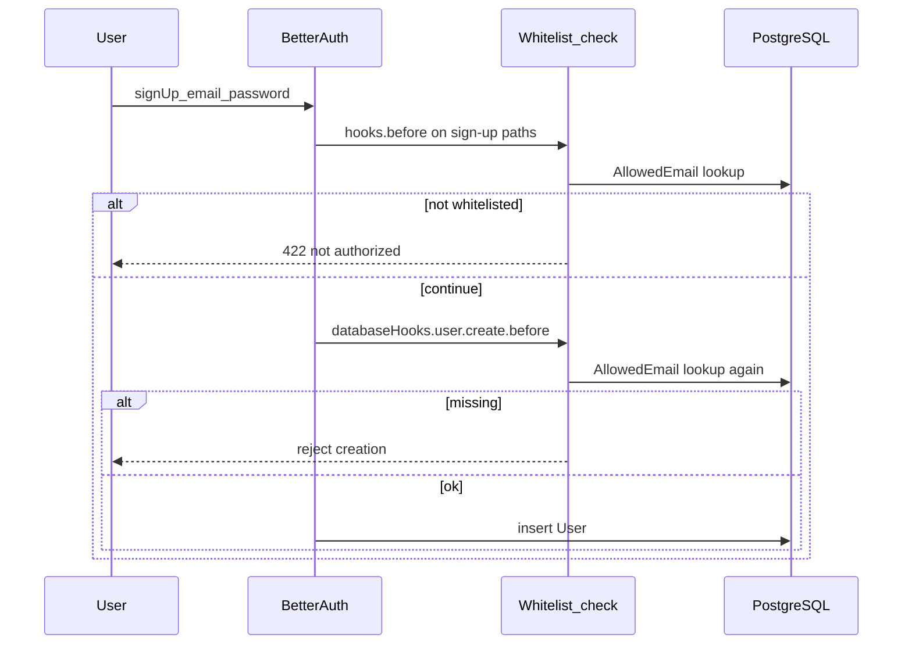
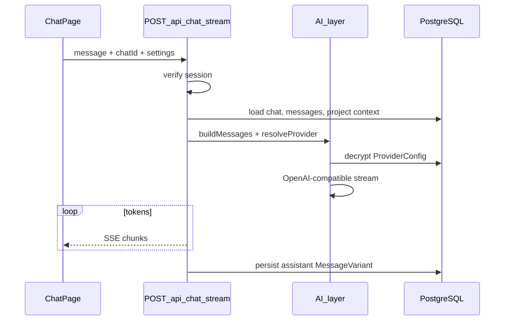
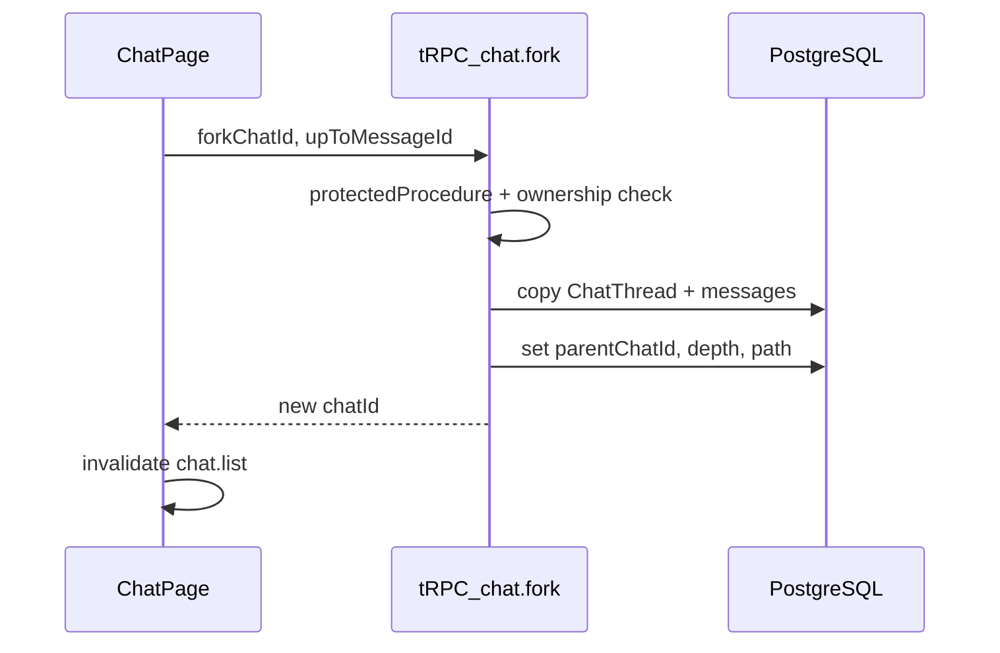

# Chatterbox — System Architecture

Chatterbox is a personal AI chat application built on the [Create T3 App](https://create.t3.gg/) stack. This document describes system context, module boundaries, request flows, technology choices, and security considerations.

## System context




### Responsibilities


| Layer                                      | Responsibility                                              |
| ------------------------------------------ | ----------------------------------------------------------- |
| **Pages (`/chat`, `/admin`, `/settings`)** | UI composition, client state, user interactions             |
| **tRPC**                                   | CRUD, configuration, non-streaming operations               |
| **Streaming API**                          | LLM completion streams (SSE)                                |
| **Better Auth**                            | Sessions, email/password sign-up (no OAuth by default)      |
| **Overlay system**                         | Modals, pop-ups, toasts via shared provider + primitives    |
| **PWA**                                    | Installable on desktop/mobile; offline shell where feasible |
| **AI provider layer**                      | Model resolution, credential decryption, request formatting |
| **RAG pipeline**                           | Chunking, embedding, retrieval for project documents        |
| **Background jobs**                        | Summaries, connector indexing, embedding backfill           |


## Current baseline (scaffold)


| Component      | Technology                       | Location                  |
| -------------- | -------------------------------- | ------------------------- |
| Framework      | Next.js 15 (Pages Router)        | `src/pages/`              |
| API            | tRPC v11 + SuperJSON             | `src/server/api/`         |
| Database       | Prisma + PostgreSQL              | `prisma/schema.prisma`    |
| Auth           | Better Auth + Prisma adapter     | `src/server/better-auth/` |
| Env validation | `@t3-oss/env-nextjs`             | `src/env.js`              |
| Styling        | CSS modules (per page/component) | `*.module.css`            |


The scaffold includes Better Auth models and a demo `Post` model to be removed during Phase 0 implementation.

## Routing architecture

Routes are **first-class pages**. Each route owns its full component tree via [flat page composition](./ui-composition.md).


| Route                   | Purpose                                                    |
| ----------------------- | ---------------------------------------------------------- |
| `/`                     | Landing or redirect to `/chat` when authenticated          |
| `/chat`                 | Chat UI **layout template** only (structure, empty states)   |
| `/chat/[chatId]`        | Same flat composition; loads thread data for active chat   |
| `/admin`                | Provider keys, model policy, email whitelist (admin only)  |
| `/settings`             | User and application preferences                           |
| `/projects/[projectId]` | Future: project detail and document management             |


Navigation uses a minimal link-only `NavBar` (via `_app.tsx`). It must not import feature components from chat or admin modules.

### Chat route split

- **`/chat`** (`pages/chat/index.tsx`): documents and renders how the three-column chat view should look—placeholders when no `chatId` is selected. Does not fetch message history.
- **`/chat/[chatId]`** (`pages/chat/[chatId].tsx`): identical sibling component tree; page hook reads `chatId` from the router and hydrates `ChatView`, `ChatContextPanel`, and tree selection.

Both files must list the same top-level siblings explicitly (or `[chatId]` re-exports composition from a shared **hook-only** module—never a layout wrapper component).

### Authentication default

Sign-in is **email and password only**. GitHub OAuth is disabled and removed from env validation. Better Auth `socialProviders` is empty unless explicitly re-enabled later.

### Overlay system (modals, pop-ups, toasts)

Central **`OverlayProvider`** (in `_app.tsx`) exposes imperative APIs:

- `toast.success | error | info` — queued, auto-dismiss, accessible live region
- `modal.open({ title, content, actions })` — focus trap, ESC close, stacked modals
- `popover` — anchored positioning for context menus and confirm pop-ups

Feature code uses these APIs instead of ad-hoc `window.alert` or one-off portals. See [ISSUE-005](./issues/ISSUE-005-overlay-system.md).

### Progressive Web App (PWA)

Chatterbox targets installability on desktop and mobile:

- Web app manifest (`public/manifest.json`)
- Service worker via `next-pwa` or Workbox (cache static assets + offline fallback page)
- Icons, `theme_color`, `display: standalone`
- HTTPS required in production

See [ISSUE-008](./issues/ISSUE-008-pwa-support.md).

### Theming

Global CSS variables in `src/styles/globals.css` switch via `data-theme="light" | "dark"` on `<html>`, driven by `UserSettings.theme`. Components use variables only—no hardcoded colors in feature CSS. See [ISSUE-007](./issues/ISSUE-007-theme-switching.md).

## Module boundaries

```
src/
├── pages/           # Route entrypoints — flat composition only
├── components/      # Feature + primitive UI (no layout shells)
├── server/
│   ├── api/         # tRPC routers
│   ├── ai/          # Provider registry, message building, streaming helpers
│   ├── rag/         # Chunk, embed, retrieve
│   ├── auth/        # Whitelist helpers shared by Better Auth hooks
│   └── jobs/        # Async summarization and indexing
├── lib/             # Crypto, formatting, shared pure utilities
└── types/           # Shared Zod schemas and TypeScript types
```

### Dependency rules

1. `**pages/**` may import `components/`, `utils/`, hooks, and tRPC client — not `server/` directly except via API routes.
2. `**components/**` may import `components/primitives/` and shared types — not sibling feature folders (e.g. `chat-view` must not import `chat-tree`).
3. `**server/ai/**` may import `server/rag/`, `db`, and `lib/` — not React or `pages/`.
4. `**server/api/**` orchestrates calls into `server/ai/`, `server/rag/`, and Prisma.

## Request flows

### Sign-up and session




Dual-layer gating ([Better Auth hooks](https://www.better-auth.com/docs/concepts/hooks)):

- `**hooks.before**` — early rejection on email/password sign-up paths with a clear message.
- `**databaseHooks.user.create.before**` — safety net for any sign-up path that bypasses the HTTP hook.

### Chat message (streaming)




### tRPC CRUD (example: fork chat)




## Context assembly (LLM input)

When streaming a reply, `build-messages.ts` assembles context in this order:

1. **Project defaults** — project system prompt and sampler overrides (if `chat.projectId` is set).
2. **Project summaries** — rolling summaries from other chats in the same project (truncated, recency-ranked).
3. **RAG retrieval** — top-k chunks from `DocumentChunk` for the project (pgvector similarity).
4. **Chat history** — messages in ordinal order; assistant turns use the **active** variant per `variantGroupId`.
5. **Per-chat overrides** — system prompt and sampler from `ChatThread` settings (right panel on `/chat`).
6. **Tools** — schemas for tools enabled on this chat session.

Token budget management: truncate summaries and RAG hits first, then oldest history, never drop the latest user message.

## AI provider layer

### Design

- Single **OpenAI-compatible HTTP client** (Vercel AI SDK) with configurable `baseUrl` per provider.
- **OpenRouter** is the primary provider; others (OpenAI, Anthropic via compatible gateways) use the same adapter.
- **Admin-managed credentials** stored encrypted in `ProviderConfig`; decrypted only on the server at request time.
- **Model allowlist** via `ModelPolicy` — streaming and model pickers reject disallowed models before calling upstream.

### Registry (`server/ai/registry.ts`)


| Function                      | Behavior                                                 |
| ----------------------------- | -------------------------------------------------------- |
| `getProvider(providerId)`     | Load enabled `ProviderConfig`, decrypt API key           |
| `listAllowedModels()`         | Join providers with `ModelPolicy` where `allowed = true` |
| `assertModelAllowed(modelId)` | Throw if model not in policy                             |


### Streaming route

- **Path:** `POST /api/chat/stream`
- **Not tRPC** — long-lived SSE does not fit request/response RPC well.
- **Config:** `bodyParser: false` or appropriate size limits for multipart if images are inlined in the same request.
- **Auth:** Session cookie validated same as tRPC context.

## RAG pipeline


| Stage    | Module                                      | Description                           |
| -------- | ------------------------------------------- | ------------------------------------- |
| Ingest   | `document.upload`, `document.syncConnector` | Store file metadata, enqueue job      |
| Chunk    | `rag/chunk.ts`                              | Split by token/size overlap           |
| Embed    | `rag/embed.ts`                              | Call admin-configured embedding model |
| Store    | Prisma + pgvector                           | `DocumentChunk.embedding`             |
| Retrieve | `rag/retrieve.ts`                           | Cosine search scoped to `projectId`   |


Large files never enter the prompt whole; only retrieved chunks do.

## Background jobs (v1)

In-process queue or scheduled tasks (upgrade to BullMQ later if needed):


| Job             | Trigger                        | Action                                |
| --------------- | ------------------------------ | ------------------------------------- |
| `summarizeChat` | Idle timeout or N new messages | Update `ProjectSummary` for thread    |
| `indexDocument` | Upload or connector sync       | Chunk + embed                         |
| `syncConnector` | Admin/user manual sync         | Pull from allowed path or GitHub repo |


## Authorization model


| Role                      | Access                                                             |
| ------------------------- | ------------------------------------------------------------------ |
| **Anonymous**             | Auth pages only                                                    |
| **User** (`role: user`)   | Own chats, projects, `/settings`; shared LLM keys (server-side)    |
| **Admin** (`role: admin`) | All user access plus `/admin` routes and `admin.`* tRPC procedures |


tRPC procedures:

- `publicProcedure` — health checks, public config if any
- `protectedProcedure` — requires valid session
- `adminProcedure` — requires `session.user.role === 'admin'`

## Security

### API keys

- Encrypt at rest with `ENCRYPTION_KEY` (AES-256-GCM or libsodium `secretbox`).
- Never return decrypted keys to the client.
- Audit log optional future enhancement.

### Email whitelist

- Case-insensitive email match on `AllowedEmail`.
- All sign-up paths rely on `databaseHooks.user.create.before`.

### Connectors

- **Local paths:** server-side allowlist of root directories; reject `..` and symlinks outside roots.
- **GitHub:** read-only token with minimal scope; clone to sandboxed temp dir for indexing.
- No arbitrary URL fetch without explicit admin configuration.

### Streaming endpoint

- Rate limit per user (future).
- Validate `chatId` ownership before stream.
- Sanitize tool call results before re-injection.

### Content security

- User-uploaded images: store in object storage or DB blob with size limits; serve with correct `Content-Type`.
- Export chat: escape if rendered as HTML elsewhere.

## Environment variables


| Variable               | Required        | Purpose                         |
| ---------------------- | --------------- | ------------------------------- |
| `DATABASE_URL`         | Yes             | PostgreSQL connection           |
| `BETTER_AUTH_SECRET`   | Prod            | Session signing                 |
| `BETTER_AUTH_GITHUB_*`  | Removed         | Not used; email/password only   |
| `ENCRYPTION_KEY`       | Yes (prod)      | Encrypt `ProviderConfig.apiKey` |
| `ADMIN_EMAIL`          | Bootstrap only  | Seed first admin user           |
| `OPENROUTER_BASE_URL`  | Optional        | Default base URL override       |


Provider API keys are stored in the database after admin setup, not in `.env`.

## Technology decisions


| Decision       | Choice                         | Rationale                                              |
| -------------- | ------------------------------ | ------------------------------------------------------ |
| Router         | Pages Router                   | Matches T3 scaffold; distinct routes per major surface |
| UI composition | Flat page-owned DOM            | Full layout visible in each page file                  |
| Styling        | CSS modules                    | Per-page and per-component; no Tailwind/shadcn         |
| CRUD API       | tRPC                           | Type-safe, already in scaffold                         |
| Streaming      | Route handler + Vercel AI SDK  | Standard SSE pattern                                   |
| Providers      | OpenAI-compatible adapter      | One client for OpenRouter and others                   |
| LLM keys       | Admin DB, shared for all users | Single deployment, centralized billing                 |
| Vectors        | pgvector in PostgreSQL         | One datastore with Prisma                              |
| Jobs           | In-process v1                  | Avoid over-engineering; migrate to queue later         |
| Realtime       | React Query invalidation       | No WebSocket until needed                              |


## Related documents

- [Data model](./data-model.md) — Prisma entities and invariants
- [Features](./features.md) — UX and API mapping per route
- [Roadmap](./roadmap.md) — Implementation phases
- [Issues](./issues/README.md) — Granular tasks with status metadata (synced to GitHub Issues via CI)
- [UI composition](./ui-composition.md) — Flat component rules
- [UI layout mockup](./ui-layout.html) — Static greybox per route

## Optional ADRs (future)

- `design/adr/001-pages-router.md`
- `design/adr/002-flat-page-composition.md`
- `design/adr/003-streaming-via-route-handler.md`

