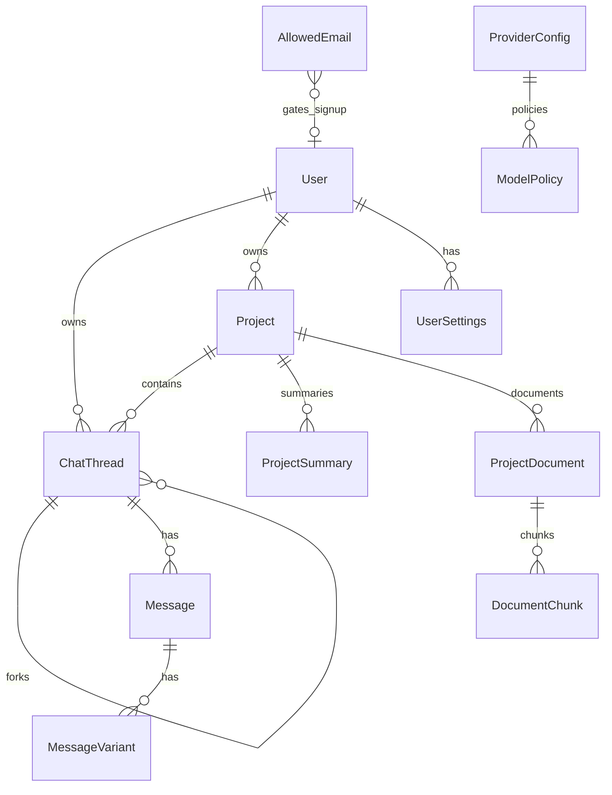

# Chatterbox — Data Model

This document defines Prisma entities, relationships, indexing strategy, and invariants for chat branching, message variants, projects, RAG, and admin configuration.

## Entity relationship overview



## Enums

```prisma
enum UserRole {
  user
  admin
}

enum MessageRole {
  user
  assistant
  system
  tool
}

enum DocumentSourceType {
  upload
  local_path
  github
}

enum ConnectorSyncStatus {
  pending
  syncing
  ready
  failed
}

enum JobStatus {
  pending
  running
  completed
  failed
}
```

## Auth and user (extends Better Auth)

Better Auth manages `User`, `Session`, `Account`, `Verification`. Chatterbox extends `User`:

| Field | Type | Notes |
|-------|------|-------|
| `role` | `UserRole` | Default `user`; seed one `admin` |
| (existing) | | `id`, `name`, `email`, `emailVerified`, `image`, timestamps |

### AllowedEmail

Gates account creation. Managed in `/admin`.

| Field | Type | Notes |
|-------|------|-------|
| `id` | `String` @id @default(cuid()) | |
| `email` | `String` | Unique, stored lowercase |
| `note` | `String?` | Admin memo |
| `createdAt` | `DateTime` | |
| `createdById` | `String?` | Admin who added |

**Indexes:** `@@unique([email])`

## Chat threads

### ChatThread

Represents one conversation. Supports hiding, forking, and optional project membership.

| Field | Type | Notes |
|-------|------|-------|
| `id` | `String` @id @default(cuid()) | |
| `userId` | `String` | Owner |
| `projectId` | `String?` | Null = not in a project |
| `parentChatId` | `String?` | Fork parent |
| `forkedFromMessageId` | `String?` | Message id at fork point (informational) |
| `depth` | `Int` @default(0) | 0 = root; child = parent.depth + 1 |
| `path` | `String` | Materialized path, e.g. `/rootId/childId/` |
| `title` | `String` | Auto or user-edited |
| `hiddenAt` | `DateTime?` | Soft hide from sidebar |
| `sortOrder` | `Int` @default(0) | Sibling ordering |
| `systemPrompt` | `String?` @db.Text | Per-chat override |
| `samplerSettings` | `Json?` | temperature, top_p, max_tokens, etc. |
| `enabledTools` | `Json?` | Tool ids enabled for this chat |
| `activeModelId` | `String?` | Last selected model |
| `createdAt` | `DateTime` | |
| `updatedAt` | `DateTime` | |

**Relations:** `user`, `project?`, `parent?`, `children[]`, `messages[]`

**Indexes:**

- `@@index([userId, hiddenAt, updatedAt])` — sidebar list
- `@@index([userId, projectId])` — project-filtered tree
- `@@index([parentChatId])` — children lookup
- `@@index([path])` — tree ordering

### Fork invariants

1. `fork(chatId, upToMessageId)` creates `newChat` with `parentChatId = chatId`, `depth = parent.depth + 1`, `path = parent.path + newChat.id + '/'`.
2. Copy all messages where `ordinal <= forkMessage.ordinal` into `newChat` (new ids; preserve content and variant structure).
3. `forkedFromMessageId` stores the source message id for UI reference.
4. Fork tree in sidebar: render by `parentChatId`, indent `depth * INDENT_PX`.

### Hide and delete

- **Hide:** set `hiddenAt`; excluded from default `chat.list` unless `includeHidden: true`.
- **Delete:** hard delete thread and cascade messages/variants (confirm in UI).

## Messages and variants

### Message

Ordered turns in a chat. User/system/tool messages have a single body; assistant turns delegate content to variants.

| Field | Type | Notes |
|-------|------|-------|
| `id` | `String` @id @default(cuid()) | |
| `chatId` | `String` | |
| `role` | `MessageRole` | |
| `content` | `Json` | Parts: `{ type: 'text'|'image', ... }[]` |
| `parentMessageId` | `String?` | Previous message in chain (optional) |
| `ordinal` | `Int` | Strict order within chat |
| `variantGroupId` | `String?` | Set for assistant rows tied to a user turn |
| `createdAt` | `DateTime` | |

**Indexes:**

- `@@unique([chatId, ordinal])`
- `@@index([chatId, createdAt])`
- `@@index([variantGroupId])`

### MessageVariant

Multiple assistant outputs for one user turn (redo/regenerate).

| Field | Type | Notes |
|-------|------|-------|
| `id` | `String` @id @default(cuid()) | |
| `messageId` | `String` | Parent `Message` (role assistant) |
| `variantGroupId` | `String` | Shared across variants of same turn |
| `variantIndex` | `Int` | 0-based sequence |
| `content` | `Json` | Same schema as message content |
| `isActive` | `Boolean` @default(false) | Exactly one active per group |
| `status` | `String` | `complete`, `error`, `streaming` |
| `errorMessage` | `String?` | For retry UI |
| `createdAt` | `DateTime` | |

**Indexes:**

- `@@unique([variantGroupId, variantIndex])`
- `@@index([messageId])`

### Variant invariants

1. Each **user turn** that receives an assistant reply gets a new `variantGroupId` (cuid).
2. One `Message` with `role: assistant` and `variantGroupId` per turn; variants hang off `MessageVariant`.
3. **Exactly one** `MessageVariant` per `variantGroupId` has `isActive: true`.
4. **Redo:** create variant `variantIndex = max + 1`, set new active, clear active on others.
5. **Switch variant:** `message.setActiveVariant({ variantGroupId, variantId })` — transactional toggle.
6. **Retry:** re-stream into same `variantIndex` on error; overwrite content on success.

Alternative (simpler): store variants only in `MessageVariant` without duplicate assistant `Message` rows — document chosen approach at implementation: **recommended: single assistant Message row + MessageVariant table** as above.

## Projects

### Project

| Field | Type | Notes |
|-------|------|-------|
| `id` | `String` @id @default(cuid()) | |
| `userId` | `String` | |
| `name` | `String` | |
| `description` | `String?` @db.Text | |
| `systemPrompt` | `String?` @db.Text | Default for chats in project |
| `samplerDefaults` | `Json?` | |
| `createdAt` | `DateTime` | |
| `updatedAt` | `DateTime` | |

**Indexes:** `@@index([userId, updatedAt])`

### ProjectSummary

Rolling summary per chat thread for cross-chat awareness.

| Field | Type | Notes |
|-------|------|-------|
| `id` | `String` @id @default(cuid()) | |
| `projectId` | `String` | |
| `chatId` | `String` | Source thread |
| `summary` | `String` @db.Text | |
| `messageCountAt` | `Int` | Messages included up to this count |
| `updatedAt` | `DateTime` | |

**Indexes:** `@@unique([projectId, chatId])`

### ProjectDocument

| Field | Type | Notes |
|-------|------|-------|
| `id` | `String` @id @default(cuid()) | |
| `projectId` | `String` | |
| `name` | `String` | Display name |
| `sourceType` | `DocumentSourceType` | |
| `sourceRef` | `String` @db.Text | Path, repo URL, or storage key |
| `mimeType` | `String?` | |
| `sizeBytes` | `Int?` | |
| `syncStatus` | `ConnectorSyncStatus` | |
| `lastSyncedAt` | `DateTime?` | |
| `createdAt` | `DateTime` | |

**Indexes:** `@@index([projectId, syncStatus])`

### DocumentChunk (RAG)

Requires PostgreSQL `pgvector` extension.

| Field | Type | Notes |
|-------|------|-------|
| `id` | `String` @id @default(cuid()) | |
| `documentId` | `String` | |
| `chunkIndex` | `Int` | |
| `content` | `String` @db.Text | |
| `embedding` | `Unsupported("vector(1536)")` | Or Prisma preview feature |
| `tokenCount` | `Int?` | |
| `metadata` | `Json?` | Page, heading, etc. |

**Indexes:**

- `@@unique([documentId, chunkIndex])`
- Vector index via migration SQL: `CREATE INDEX ON document_chunk USING ivfflat (embedding vector_cosine_ops)`

## Admin configuration

### ProviderConfig

| Field | Type | Notes |
|-------|------|-------|
| `id` | `String` @id @default(cuid()) | |
| `providerId` | `String` | e.g. `openrouter`, `openai` |
| `displayName` | `String` | |
| `baseUrl` | `String` | OpenAI-compatible endpoint |
| `apiKeyEncrypted` | `String` @db.Text | |
| `enabled` | `Boolean` @default(true) | |
| `updatedAt` | `DateTime` | |

**Indexes:** `@@unique([providerId])`

### ModelPolicy

| Field | Type | Notes |
|-------|------|-------|
| `id` | `String` @id @default(cuid()) | |
| `providerId` | `String` | |
| `modelId` | `String` | Upstream model id |
| `displayName` | `String?` | |
| `allowed` | `Boolean` @default(true) | Whitelist mode: only allowed=true |
| `isDefault` | `Boolean` @default(false) | |

**Indexes:** `@@unique([providerId, modelId])`

## User settings

### UserSettings

Per-user preferences for `/settings` (not per-chat).

| Field | Type | Notes |
|-------|------|-------|
| `id` | `String` @id @default(cuid()) | |
| `userId` | `String` @unique | |
| `theme` | `String?` | `light`, `dark`, `system` |
| `defaultSystemPrompt` | `String?` @db.Text | Applied to new chats; see prompt resolution below |
| `defaultModelId` | `String?` | |
| `preferences` | `Json?` | Extensible bag |
| `updatedAt` | `DateTime` | |

### System prompt resolution (runtime)

When building LLM context, resolve system prompt in order (first non-empty wins):

1. `ChatThread.systemPrompt` (per-chat override on `/chat`)
2. `Project.systemPrompt` (if chat has `projectId`)
3. `UserSettings.defaultSystemPrompt` (from `/settings`)
4. Application fallback string in code

## Background jobs (optional table)

### BackgroundJob

| Field | Type | Notes |
|-------|------|-------|
| `id` | `String` @id @default(cuid()) | |
| `type` | `String` | `summarize`, `index_document`, `sync_connector` |
| `payload` | `Json` | |
| `status` | `JobStatus` | |
| `error` | `String?` | |
| `createdAt` | `DateTime` | |
| `completedAt` | `DateTime?` | |

## Content JSON schemas (application-level)

### Message content part

```typescript
type ContentPart =
  | { type: "text"; text: string }
  | { type: "image"; url: string; mimeType?: string; alt?: string };
```

### Sampler settings

```typescript
type SamplerSettings = {
  temperature?: number;
  top_p?: number;
  max_tokens?: number;
  frequency_penalty?: number;
  presence_penalty?: number;
  stop?: string[];
};
```

## Migration notes

1. Enable `pgvector` extension before `DocumentChunk` migration.
2. Remove demo `Post` model from scaffold schema.
3. Add `role` to `User` with default `user`.
4. Seed `AllowedEmail` and admin user via `ADMIN_EMAIL` env on first deploy.

## Query patterns

| Use case | Query |
|----------|-------|
| Sidebar roots | `ChatThread` where `userId`, `parentChatId null`, `projectId` filter, `hiddenAt null`, order by `updatedAt desc` |
| Fork children | `ChatThread` where `parentChatId = id`, order by `sortOrder`, `createdAt` |
| Messages | `Message` where `chatId`, order by `ordinal asc`, include variants |
| Active variant | `MessageVariant` where `variantGroupId`, `isActive true` |
| RAG search | Raw SQL: cosine distance on chunks join documents where `projectId` |

## Related documents

- [Architecture](./architecture.md)
- [Features](./features.md)
- [UI composition](./ui-composition.md)
