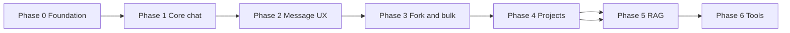

# Chatterbox — Implementation Roadmap

Phased delivery order with dependencies. Each phase assumes the previous phase is complete and deployed locally.

**Granular tasks:** Every implementable unit has a file under [`design/issues/`](./issues/README.md) with metadata (`type`, `layer`, `status`) and acceptance criteria. Update issue `status` when work completes.

---

## Phase 0 — Foundation

**Goal:** Runnable app skeleton with auth gating, schema, routes, and design docs.

### Deliverables

- [x] Design documentation (`design/*.md`, `design/ui-layout.html`, `design/issues/`)
- [ ] Prisma schema: chat, message, variant, admin, settings tables; remove demo `Post`
- [ ] `User.role`, seed admin via `ADMIN_EMAIL`, `AllowedEmail` table
- [ ] Better Auth: `databaseHooks.user.create.before` + `hooks.before` whitelist
- [ ] `adminProcedure` in `src/server/api/trpc.ts`
- [ ] Stub pages with **flat composition** (see issues `ISSUE-009`–`011`):
  - `src/pages/chat/index.tsx` — layout template only
  - `src/pages/chat/[chatId].tsx` — hydrated chat
  - `src/pages/admin/index.tsx`, `src/pages/settings/index.tsx`
- [ ] Overlay system, Icon, theme, PWA (`ISSUE-005`–`008`)
- [ ] Stub components (empty state UI) per [ui-composition.md](./ui-composition.md)
- [ ] `NavBar` in `_app.tsx` (links only)
- [ ] Extend `src/env.js`: `ENCRYPTION_KEY`, `ADMIN_EMAIL`
- [ ] Update `.env.example`

### Dependencies

- PostgreSQL running (`start-database.sh` or external)
- `pnpm db:push` or `db:migrate`

### Exit criteria

- Whitelisted email can sign up; non-whitelisted cannot
- Admin can open `/admin`; regular user cannot
- `/chat` shows three sibling panels with placeholder content
- `pnpm check` passes

---

## Phase 1 — Core chat

**Goal:** Send messages and receive streamed assistant replies via OpenRouter.

### Deliverables

- [ ] `ProviderConfig` + encryption; admin UI for keys
- [ ] `ModelPolicy` + admin allow/deny UI
- [ ] `server/ai/registry.ts` + OpenAI-compatible client
- [ ] `POST /api/chat/stream` with session auth
- [ ] tRPC: `chat.create`, `chat.list`, `chat.get`, `chat.update`, `chat.delete`
- [ ] tRPC: `message.list`
- [ ] `ChatView`: composer, message list, model selector
- [ ] `ChatTreeSidebar`: list, select, new, hide, delete
- [ ] Image attachment upload (basic)

### Dependencies

- Phase 0
- Admin configures at least one provider and one allowed model

### Exit criteria

- End-to-end message round-trip with streaming
- Chats persist and reload from sidebar

---

## Phase 2 — Message UX

**Goal:** Variants, redo, retry, copy, and per-chat settings panel.

### Deliverables

- [ ] `MessageVariant` table + invariants (one active per group)
- [ ] `message.regenerate`, `message.setActiveVariant`, `message.retry`
- [ ] Hover actions on assistant bubbles
- [ ] `ChatContextPanel`: system prompt + sampler fields wired to `chat.updateSettings`
- [ ] `provider.listModels` for non-admin model picker

### Dependencies

- Phase 1

### Exit criteria

- Redo creates new variant; arrows switch; copy works
- Sampler and system prompt affect subsequent streams

---

## Phase 3 — Forking and bulk operations

**Goal:** Thread tree, fork, export, multi-delete.

### Deliverables

- [ ] `chat.fork` with message copy and `depth` / `path`
- [ ] Tree indent in `ChatTreeSidebar`
- [ ] Selection mode + `message.deleteMany`
- [ ] `chat.export` + download/copy in `ChatContextPanel`

### Dependencies

- Phase 2

### Exit criteria

- Fork appears nested in sidebar
- Export produces readable transcript file

---

## Phase 4 — Projects (without RAG)

**Goal:** Group chats; cross-chat summaries; project filter in sidebar.

### Deliverables

- [ ] `Project`, `ProjectSummary` models
- [ ] tRPC `project.*`
- [ ] Project section in sidebar; leave-project control
- [ ] `build-messages` injects summaries
- [ ] Background `summarizeChat` job (in-process)
- [ ] Assign chat to project

### Dependencies

- Phase 3

### Exit criteria

- Chats in a project see other threads’ summaries in context
- Project filter limits visible threads

---

## Phase 5 — Documents and RAG

**Goal:** Attach documents and connectors; retrieve chunks in prompts.

### Deliverables

- [ ] pgvector migration + `DocumentChunk`
- [ ] `document.upload`, chunk + embed pipeline
- [ ] Connectors: `local_path`, `github` with security allowlists
- [ ] `document.syncConnector` + index job
- [ ] RAG in `build-messages` (top-k)
- [ ] Project documents UI (page or modal on project route)

### Dependencies

- Phase 4
- Embedding model configured in admin

### Exit criteria

- Large PDF/text answers using retrieved chunks, not full file in prompt

---

## Phase 6 — Tools

**Goal:** Function calling and tool message persistence.

### Deliverables

- [ ] Tool registry (built-in tools TBD)
- [ ] `chat.enabledTools` + UI toggles in `ChatView`
- [ ] AI SDK tool loop in stream handler
- [ ] Persist `role: tool` messages

### Dependencies

- Phase 2 (stable streaming)

### Exit criteria

- At least one tool callable from chat with result shown in thread

---

## Post-MVP backlog

| Item | Notes |
|------|-------|
| `/chat/[chatId]` deep links | Same flat page, read id from router |
| Rate limiting on stream | Per-user quotas |
| BullMQ job queue | Replace in-process jobs |
| Per-user API keys | If deployment grows beyond single admin |
| WebSocket streaming | Only if polling insufficient |
| Audit log for admin actions | Compliance |
| Optional ADRs | See [architecture.md](./architecture.md) |

---

## Risk mitigations by phase

| Phase | Risk | Mitigation |
|-------|------|------------|
| 0 | OAuth bypasses whitelist | `databaseHooks.user.create.before` |
| 1 | Key leakage | Encrypt at rest; never return to client |
| 2 | Variant state bugs | DB constraint: one `isActive` per group |
| 3 | Fork copy size | Limit message count or confirm UX |
| 5 | Path traversal | Server allowlist for local connectors |
| 5 | Embedding cost | Admin chunk size + model settings |

---

## Related documents

- [Architecture](./architecture.md)
- [Data model](./data-model.md)
- [Features](./features.md)
- [UI composition](./ui-composition.md)
