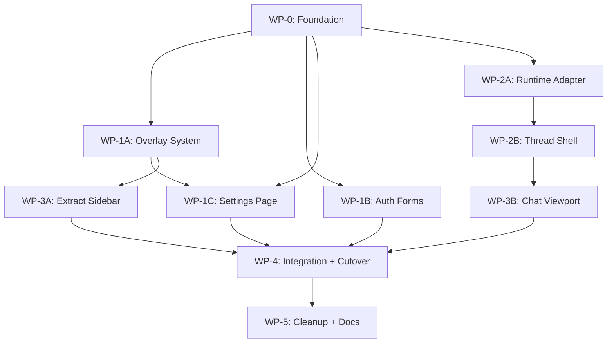

# Frontend Refactor Execution Plan

> Description: Phased execution plan for pivoting to shadcn + assistant-ui. Work packages are sized for parallel subagents with explicit dependencies, deliverables, and acceptance criteria. **Awaiting user green light before execution.**

**Prerequisite reading:** [`fe-refactor-audit.md`](./fe-refactor-audit.md)

---

## Goals

1. Replace hand-rolled UI primitives with **shadcn/ui** (Tailwind-based, source-owned components).
2. Replace the monolithic chat page with **assistant-ui** runtime + primitives.
3. Preserve existing **API contracts** and **server prefetch** patterns — no backend rewrite unless strictly necessary.
4. Ship incrementally: each phase leaves the app buildable and testable.

## Non-Goals (this refactor)

- Agentic tool UI (activity timeline, approval chips) — defer to Phase 6 after backend lands
- Migrating every CSS Module file to Tailwind in one pass
- Changing auth, proxy, DB schema, or service-layer business logic
- Image generation UI (not in scope today)

---

## Decisions Requiring Your Approval

| # | Decision | Recommendation | Alternative |
|---|----------|----------------|-------------|
| D1 | **Add Tailwind CSS** | Yes — required for shadcn | Cannot use shadcn without it |
| D2 | **New dependencies** | `tailwindcss`, `@assistant-ui/react`, `@assistant-ui/react-ai-sdk`, `@ai-sdk/react`, shadcn peer deps (`clsx`, `tailwind-merge`, `class-variance-authority`, Radix primitives via shadcn CLI) | Discuss before install |
| D3 | **Streaming adapter** | `useExternalStoreRuntime` wrapping existing POST+SSE protocol | Rewrite API to AI SDK wire format + `AssistantChatTransport` |
| D4 | **Icon library** | Switch new UI to **Lucide** (shadcn default); keep MingCute in untouched legacy components until migrated | Keep MingCute everywhere (non-standard shadcn setup) |
| D5 | **Hybrid styling during migration** | Tailwind for shadcn/assistant-ui components; keep CSS Modules for unmigrated page shells | Big-bang Tailwind migration |
| D6 | **Branch strategy** | Feature branch off `develop`; one PR per phase (or per work package if phases are large) | Single mega-PR |
| D7 | **Delete legacy hooks immediately** | No — keep `use-toaster`/`use-modal` until consumers are migrated (Phase 2) | Delete in Phase 0 |

**Default assumptions in this plan:** D1–D7 as recommended.

---

## Dependency Graph



**Parallelizable after WP-0:** WP-1A, WP-1B, WP-2A (three subagents)  
**Parallelizable after WP-2A + WP-1A:** WP-2B, WP-1C, WP-3A (three subagents)  
**Sequential finale:** WP-3B → WP-4 → WP-5

---

## Work Packages

### WP-0: Foundation & Tooling

**Subagent:** `shell` (needs network for package install)  
**Estimated scope:** Small–medium  
**Blocks:** Everything else

#### Tasks
1. Install Tailwind CSS v4 (or v3 per shadcn CLI default) + PostCSS for Next.js 16
2. Run `npx shadcn@latest init` — configure:
   - Style: `new-york` (or match project aesthetic)
   - Base color: custom (map from `tokens.css`)
   - CSS variables: yes
   - `src/components/ui` alias: `@/components/ui`
   - RSC: yes
   - Icon library: `lucide`
3. Create `src/lib/utils.ts` with `cn()` helper
4. Bridge design tokens in `globals.css`:

   ```
   tokens.css semantic names  →  shadcn --background, --foreground, --primary, etc.
   ```

   Preserve the existing dark green-tinted palette from `docs/style_guide.md`.
5. Add baseline shadcn components (do not wire into pages yet):
   - `button`, `input`, `textarea`, `label`
   - `dialog`, `alert-dialog`
   - `sonner` (toast)
   - `tooltip`, `separator`
   - `card`, `tabs`
   - `sidebar` (evaluate against existing custom sidebar)
6. Verify `npm run build`, `npm run lint`, `npm run typecheck` pass

#### Deliverables
- `components.json`
- `tailwind.config.*` / PostCSS config
- Updated `src/app/globals.css`
- `src/lib/utils.ts`
- `src/components/ui/*` (baseline set)
- Token bridge documented in file comments

#### Acceptance Criteria
- [ ] `npx shadcn@latest info --json` returns valid project config
- [ ] A throwaway test page or Storybook-less smoke render of `Button` works
- [ ] Existing pages still render (no visual regression required yet — Tailwind coexists with CSS Modules)
- [ ] Biome + TypeScript clean

#### Out of Scope
- Migrating any existing page
- Removing CSS Modules

---

### WP-1A: Overlay System Migration

**Subagent:** `generalPurpose`  
**Depends on:** WP-0  
**Parallel with:** WP-1B, WP-2A

#### Tasks
1. Add shadcn `sonner` to `RootLayout` — `<Toaster />` alongside or replacing `EventProvider` toast path
2. Migrate `useToaster()` call sites to `toast()` from sonner:
   - Grep all `useToaster` / `pushToast` usages
   - Map `Intent` enum → sonner variants or custom className
3. Migrate `useModal()` call sites to shadcn `Dialog` / `AlertDialog`:
   - `ThreadActionModals.tsx` (rename/delete confirmations)
   - Any settings or chat modals
4. Keep `EventProvider` temporarily if banner path still needed; migrate banner to shadcn `Alert` or defer
5. Do **not** delete `src/hooks/use-toaster/` or `use-modal/` until all consumers migrated

#### Key Files
- `src/app/layout.tsx`
- `src/hooks/event-provider/`
- `src/hooks/use-toaster/`
- `src/hooks/use-modal/`
- `src/components/chat/ThreadActionModals.tsx`
- All grep hits for modal/toast usage

#### Deliverables
- Sonner wired in root layout
- Modal/toast consumers migrated to shadcn
- Short migration note in commit message / memory doc

#### Acceptance Criteria
- [ ] Rename/delete thread modals work with shadcn Dialog
- [ ] Error toasts in chat and settings use Sonner
- [ ] No remaining `useModal()` in migrated files
- [ ] `npm run build` passes

---

### WP-1B: Auth Forms Migration

**Subagent:** `generalPurpose`  
**Depends on:** WP-0  
**Parallel with:** WP-1A, WP-2A

#### Tasks
1. Migrate `SignInForm` and `SignUpForm` to shadcn:
   - `Card`, `CardHeader`, `CardTitle`, `CardContent`
   - `Field` / `FieldGroup` / `Label` / `Input` (per shadcn skill forms rules)
   - `Button` for submit
2. Migrate `AuthQueryBanners` to shadcn `Alert`
3. Replace `auth.module.css` layout with Tailwind utilities where possible
4. Keep `page.module.css` / `signup.module.css` shell centering OR consolidate into shared layout class

#### Key Files
- `src/components/auth/sign-in-form.tsx`
- `src/components/auth/sign-up-form.tsx`
- `src/components/auth/auth-query-banners.tsx`
- `src/components/auth/auth.module.css`
- `src/app/page.tsx`, `src/app/signup/page.tsx`

#### Deliverables
- Auth forms using shadcn components
- Reduced or eliminated `auth.module.css`

#### Acceptance Criteria
- [ ] Sign-in and sign-up flows work end-to-end
- [ ] Whitelist error banner displays correctly
- [ ] Focus rings and form validation match shadcn patterns
- [ ] Visual alignment with `docs/style_guide.md` palette (via token bridge)

---

### WP-1C: Settings Page Migration

**Subagent:** `generalPurpose`  
**Depends on:** WP-0, WP-1A (for toast/modal if settings uses them)  
**Parallel with:** WP-2B, WP-3A (after WP-1A done)

#### Tasks
1. Migrate settings page to shadcn layout:
   - `Tabs` or shadcn `Sidebar` for category navigation (replace custom `.categoryButton`)
   - `Card` for provider sections
   - `Field`/`FieldGroup` for system prompt, model selects
2. Replace custom `Button` and `Select` imports with shadcn equivalents in settings only
3. Replace settings toasts/modals with Sonner/Dialog (if not done in WP-1A)
4. Migrate `settings.module.css` → Tailwind incrementally (keep complex responsive rules if needed)

#### Key Files
- `src/app/settings/page.tsx`
- `src/app/settings/settings.module.css`
- `src/components/settings/SettingsInitialDataProvider.tsx` (likely unchanged)

#### Deliverables
- Settings page on shadcn components
- Provider CRUD still functional

#### Acceptance Criteria
- [ ] Load/save AI settings works
- [ ] Provider add/edit/delete works
- [ ] Embedding model selection works
- [ ] Responsive layout preserved (mobile category tabs)
- [ ] `npm run build` passes

---

### WP-2A: Chat Runtime Adapter

**Subagent:** `generalPurpose` (read `.agents/skills/assistant-ui/SKILL.md` + `ai-sdk` skill first)  
**Depends on:** WP-0  
**Parallel with:** WP-1A, WP-1B

This is the **highest-risk technical work** — isolates API coupling from UI.

#### Tasks
1. Install packages:
   - `@assistant-ui/react`
   - `@assistant-ui/react-ai-sdk` (for types/utilities even if using ExternalStore)
   - `@ai-sdk/react` (peer)
   - Optionally `@assistant-ui/react-markdown`
2. Create shared client types — **import from service layer** instead of duplicating:
   - `src/lib/chat/types.ts` re-exporting `ChatMessageDto`, `ChatThreadPayload`, sidebar types from services
3. Create `src/lib/chat/runtime/chatterbox-runtime.ts`:
   - Implement `useExternalStoreRuntime` (or `useLocalRuntime`) adapter
   - Map `ChatMessageDto` ↔ assistant-ui `ThreadMessageLike` / message parts
   - Initial state from `ChatInitialDataProvider`
4. Create `src/lib/chat/runtime/send-message.ts`:
   - Wrap `POST /api/chat/messages` and `POST /api/chat/threads/:id/messages`
   - Optimistic user message insertion
   - Return `assistantMessage` with `status: "streaming"`
5. Create `src/lib/chat/runtime/stream-message.ts`:
   - Wrap `EventSource` SSE (`content` / `done` / `error`)
   - Guard handlers with `threadId` to prevent stale updates
   - Map terminal states to assistant-ui status model
6. Create `src/lib/chat/runtime/thread-cache.ts`:
   - Port or wrap `app-cache.ts` integration behind adapter interface
7. Unit tests for message mapping and SSE state machine (Vitest)

#### Key Files (new)
```
src/lib/chat/
  types.ts
  runtime/
    chatterbox-runtime.ts      # useExternalStoreRuntime hook
    send-message.ts
    stream-message.ts
    message-mapper.ts          # DTO ↔ assistant-ui parts
    thread-cache.ts
  runtime/chatterbox-runtime.test.ts
```

#### Key Files (read, do not rewrite)
- `src/lib/services/chat.ts` — DTO shapes
- `src/lib/cache/app-cache.ts`
- `src/app/chat/page.tsx` — extract logic from here

#### Deliverables
- Runtime adapter hook with no UI dependencies
- Tests for mapper + stream state transitions
- JSDoc on exported hooks

#### Acceptance Criteria
- [ ] Adapter can load initial thread messages from `ChatThreadPayload`
- [ ] Adapter can send a message and receive streaming updates via SSE
- [ ] Thread-id guard prevents cross-thread stream pollution
- [ ] `npm test` passes for new unit tests
- [ ] No changes to API routes required

#### Explicit Non-Goal
- Do not touch `page.tsx` rendering yet — adapter only

---

### WP-2B: assistant-ui Thread Shell

**Subagent:** `generalPurpose` (read shadcn chat rules + assistant-ui skill)  
**Depends on:** WP-0, WP-2A

#### Tasks
1. Add shadcn chat primitives:
   ```bash
   npx shadcn@latest add message-scroller message bubble attachment marker
   ```
2. Scaffold `src/components/assistant-ui/thread.tsx` (from assistant-ui template, adapted)
3. Create styled subcomponents:
   - `src/components/assistant-ui/markdown-text.tsx` — port typography from `message-blip.module.css` or use `@assistant-ui/react-markdown`
   - `src/components/assistant-ui/composer.tsx` — wraps `ComposerPrimitive` + shadcn `Textarea`/`Button`
4. Apply project theme via Tailwind semantic tokens (not default zinc)
5. Wire `useChatterboxRuntime()` (from WP-2A) into a `ChatRuntimeProvider` wrapper component
6. Render thread shell in isolation — **feature flag or dev-only route** (`/chat-v2` or `?ui=v2`) for parallel testing without cutover

#### Key Files (new)
```
src/components/assistant-ui/
  thread.tsx
  composer.tsx
  markdown-text.tsx
  chat-runtime-provider.tsx
src/app/chat-v2/page.tsx          # temporary parallel route (remove in WP-5)
```

#### Deliverables
- Composable thread viewport using assistant-ui + shadcn
- Dev route to test runtime adapter + UI together

#### Acceptance Criteria
- [ ] Send message → stream → complete works on `/chat-v2`
- [ ] Markdown renders (headings, code blocks, links)
- [ ] Composer disabled states: waiting, streaming, error
- [ ] Scroll follows streaming content (MessageScroller owns scroll — no manual `useEffect`)
- [ ] Matches dark palette via token bridge

---

### WP-3A: Extract Chat Sidebar

**Subagent:** `generalPurpose`  
**Depends on:** WP-0, WP-1A (modals)  
**Parallel with:** WP-2B, WP-1C

#### Tasks
1. Extract sidebar logic from `page.tsx` into `src/components/chat/chat-sidebar-shell.tsx`:
   - Props/callbacks for thread selection, project CRUD, archive actions
   - No message list or streaming logic
2. Evaluate shadcn `Sidebar` vs keeping custom `SidebarProvider` resize logic:
   - **Preference:** Keep resize behavior if shadcn Sidebar doesn't support it cleanly; wrap with shadcn styling
3. Migrate sidebar list items (`ChatThread`, `ProjectFolder`, `ArchivedThread`, lib `Thread`) to shadcn-styled components:
   - Use shadcn `Button` variant ghost for actions
   - Use `DropdownMenu` for thread context menu (if applicable)
4. Migrate `ThreadActionModals` triggers to live in extracted sidebar (already shadcn from WP-1A)
5. Keep `ChatSidebar.tsx` as thin wrapper or replace with `chat-sidebar-shell.tsx`

#### Key Files
- `src/app/chat/page.tsx` — extract from
- `src/components/chat/ChatSidebar.tsx`
- `src/components/chat/ProjectFolder.tsx`
- `src/components/chat/ChatThread.tsx`
- `src/components/lib/sidebar/*`
- `src/components/lib/thread/*`

#### Deliverables
- `ChatSidebarShell` component with clear props interface
- Sidebar usable by both old `page.tsx` and new `/chat-v2` during transition

#### Acceptance Criteria
- [ ] Thread list, project folders, archive toggle work
- [ ] New chat, settings nav, sidebar resize/mobile overlay work
- [ ] `page.tsx` line count reduced by ≥200 lines (sidebar extracted)
- [ ] No regression in sidebar CRUD API calls

---

### WP-3B: Chat Viewport Cutover Prep

**Subagent:** `generalPurpose`  
**Depends on:** WP-2A, WP-2B, WP-3A

#### Tasks
1. Combine `ChatRuntimeProvider` + `ChatSidebarShell` + assistant-ui `Thread` into `src/components/chat/chat-shell.tsx`
2. Port remaining `page.tsx` responsibilities into focused hooks:
   - `useChatThreads()` — sidebar data fetching/mutations
   - `useActiveThread()` — URL `?thread=` sync
   - `useChatNavigation()` — router.replace on thread switch
3. Ensure `ChatInitialDataProvider` seeds runtime initial state
4. Wire input state machine (`ChatInputState` equivalent) through composer disabled prop
5. Error display: map `message.error` to assistant-ui error part or inline alert
6. Delete stub toolbar buttons (attachments/tools/settings) OR hide until agentic phase

#### Deliverables
- `ChatShell` — drop-in replacement for `ChatPageContent`
- Focused hooks with JSDoc

#### Acceptance Criteria
- [ ] `/chat-v2` feature parity with `/chat` for: send, stream, switch thread, new chat, archive
- [ ] URL `?thread=` deep linking works
- [ ] `app-cache.ts` still accelerates thread switches
- [ ] No `EventSource` leaks on unmount or thread switch

---

### WP-4: Integration & Cutover

**Subagent:** `generalPurpose` (single agent — needs full context)  
**Depends on:** WP-1B, WP-1C, WP-3B

#### Tasks
1. Replace `src/app/chat/page.tsx` implementation with `ChatShell`
2. Remove `/chat-v2` dev route (or redirect to `/chat`)
3. Delete unused imports from old `page.tsx` code path
4. Run full validation suite
5. Manual QA checklist (see below)
6. Update `AGENTS.md` stack section to reflect installed deps

#### Deliverables
- `/chat` on assistant-ui + shadcn
- Old chat rendering path removed

#### Acceptance Criteria
- [ ] All items in QA checklist pass
- [ ] `npm run build`, `npm run lint`, `npm run typecheck`, `npm test` pass
- [ ] No references to `UserMessageBlip` / `AssistantMessageBlip` in `/chat` path

---

### WP-5: Cleanup & Documentation

**Subagent:** `generalPurpose`  
**Depends on:** WP-4

#### Tasks
1. Delete dead code:
   - `src/components/chat/chat-data.ts`
   - `src/components/lib/message-blip/` (if fully replaced)
   - `src/components/lib/chat-input/` (if fully replaced)
   - `src/hooks/use-toaster/`, `use-modal/`, `use-banner/` (if no consumers)
   - `src/hooks/event-provider/` (if fully replaced)
   - `/chat-v2` route if still present
2. Delete orphaned CSS Modules for removed components
3. Consolidate duplicate types — client imports from `src/lib/chat/types.ts`
4. Fill documentation:
   - `docs/architecture.md` — update FE layer description
   - `docs/features/chat.md` — new chat UI architecture, runtime adapter, streaming
   - Update `docs/memory/fe-refactor-audit.md` with "completed" notes
   - Create `docs/memory/fe-refactor-outcome.md`
5. Evaluate: migrate remaining `lib/button`, `lib/select` usages or mark as legacy

#### Deliverables
- Smaller codebase, no dead files
- Architecture docs current

#### Acceptance Criteria
- [ ] Grep confirms no imports of deleted modules
- [ ] `npm run build` passes
- [ ] Docs reflect actual stack

---

### WP-6: Agentic UI (Deferred — Future)

**Trigger:** When backend WIP lands (`registry.ts`, tool routes, migration `009`, SSE extensions)

| Component | Approach |
|-----------|----------|
| `AgentActivityTimeline` | shadcn `Card` + custom timeline with semantic tokens |
| `ToolPermissionChip` | shadcn `Badge` + `Button` approve/deny |
| Tool call message parts | assistant-ui `ToolFallback` / custom part renderer |
| `requires-action` status | Composer disable + approval modal |
| SSE extensions | Extend `stream-message.ts` event types |

**Do not start until user explicitly green-lights agentic backend + this plan's WP-0–5 are complete.**

---

## Subagent Assignment Summary

| Phase | Work Package | Subagent Type | Can Parallelize |
|-------|-------------|---------------|-----------------|
| 0 | WP-0 Foundation | `shell` | No — first |
| 1 | WP-1A Overlays | `generalPurpose` | Yes (after WP-0) |
| 1 | WP-1B Auth | `generalPurpose` | Yes (after WP-0) |
| 1 | WP-2A Runtime Adapter | `generalPurpose` | Yes (after WP-0) |
| 2 | WP-2B Thread Shell | `generalPurpose` | After WP-2A |
| 2 | WP-1C Settings | `generalPurpose` | After WP-1A |
| 2 | WP-3A Sidebar Extract | `generalPurpose` | After WP-1A |
| 3 | WP-3B Viewport Prep | `generalPurpose` | After WP-2B + WP-3A |
| 4 | WP-4 Cutover | `generalPurpose` | Solo — full context |
| 5 | WP-5 Cleanup | `generalPurpose` | After WP-4 |

### Suggested Execution Waves

```
Wave 1 (1 subagent):  WP-0
Wave 2 (3 subagents): WP-1A + WP-1B + WP-2A
Wave 3 (3 subagents): WP-2B + WP-1C + WP-3A
Wave 4 (1 subagent):  WP-3B
Wave 5 (1 subagent):  WP-4
Wave 6 (1 subagent):  WP-5
```

---

## Per-Subagent Prompt Template

When green-lit, each subagent should receive:

```
Task: <WP-ID> — <title>
Branch: feature/fe-refactor (off develop)
Read first:
  - docs/memory/fe-refactor-audit.md
  - docs/memory/fe-refactor-plan.md (section WP-X)
  - .agents/skills/shadcn/SKILL.md (if UI work)
  - .agents/skills/assistant-ui/SKILL.md (if runtime/chat work)

Constraints:
  - Do not modify src/lib/services/* or src/app/api/* unless WP explicitly says so
  - Do not delete legacy code unless WP explicitly says so
  - Run npm run build && npm run lint && npm run typecheck before finishing
  - Document exported functions with JSDoc
  - Update docs/memory/ if outcome differs from plan

Deliverables: <from WP section>
Acceptance criteria: <from WP section>
```

---

## QA Checklist (WP-4 Manual Validation)

### Auth
- [ ] Sign in with valid credentials → redirects to `/chat`
- [ ] Sign up whitelist rejection shows banner
- [ ] Sign out → redirected to `/`

### Chat — Core
- [ ] New chat from sidebar → empty thread, send first message creates thread
- [ ] Message streams token-by-token
- [ ] Stream completes → composer re-enabled
- [ ] Copy message action works
- [ ] Error state: provider failure shows error, composer recovers

### Chat — Sidebar
- [ ] Switch threads via sidebar → messages load
- [ ] `?thread=<id>` deep link works on refresh
- [ ] Create project, add thread to project
- [ ] Rename thread (Dialog)
- [ ] Delete thread (AlertDialog)
- [ ] Archive / unarchive thread
- [ ] Sidebar resize (desktop) and overlay (mobile)

### Chat — Cache
- [ ] Revisit recently opened thread → fast load from cache
- [ ] Cache invalidation after new message

### Settings
- [ ] Change model, save, new thread uses new model
- [ ] Add/remove provider
- [ ] System prompt persists

### Regression
- [ ] No console errors during normal flow
- [ ] No layout shift on stream start
- [ ] Fonts (SN Pro, JetBrains Mono) still applied

---

## Risk Register

| Risk | Likelihood | Impact | Mitigation |
|------|------------|--------|------------|
| Tailwind conflicts with CSS Modules | Medium | Low | Hybrid approach (D5); namespace shadcn under `@layer` |
| `useExternalStoreRuntime` API mismatch | Medium | High | WP-2A unit tests; `/chat-v2` dev route before cutover |
| shadcn Sidebar lacks resize | High | Medium | Keep custom resize hook, shadcn skin only |
| SSE stale state on thread switch | Medium | High | Thread-id guard in WP-2A (explicit task) |
| Select component regression in settings | Medium | Medium | Settings is isolated WP-1C; custom Select stays until then |
| Large PR review fatigue | High | Medium | One PR per wave; dev route for incremental review |
| Token palette drift from style guide | Low | Medium | Token bridge in WP-0 with visual QA gate |

---

## PR Strategy

| PR | Contains | Base |
|----|----------|------|
| PR-1 | WP-0 Foundation | `develop` |
| PR-2 | WP-1A + WP-1B + WP-2A | PR-1 |
| PR-3 | WP-2B + WP-1C + WP-3A | PR-2 |
| PR-4 | WP-3B | PR-3 |
| PR-5 | WP-4 Cutover | PR-4 |
| PR-6 | WP-5 Cleanup + docs | PR-5 |

Alternatively: **one PR per work package** if you prefer smaller reviews (6–8 PRs total).

---

## Open Questions for Review

1. **PR granularity** — one per wave (6 PRs) or one per work package (10 PRs)?
2. **Dev route naming** — `/chat-v2` acceptable, or prefer feature flag `?ui=v2`?
3. **Custom Select** — migrate settings to shadcn `Select` in WP-1C, or keep custom `Select` until post-cleanup?
4. **EventProvider banner** — migrate in WP-1A or defer?
5. **Agentic UI** — confirm defer to WP-6 until backend is on disk?
6. **E2E tests** — add Playwright coverage in WP-4 or WP-5?

---

## Approval Checklist

- [ ] Decisions D1–D7 approved (or noted changes)
- [ ] Wave execution order approved
- [ ] PR strategy chosen
- [ ] Open questions answered
- [ ] Green light to start WP-0

**Status: AWAITING REVIEW**
